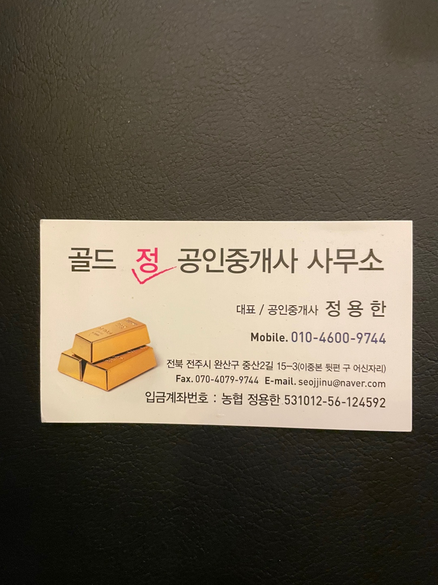
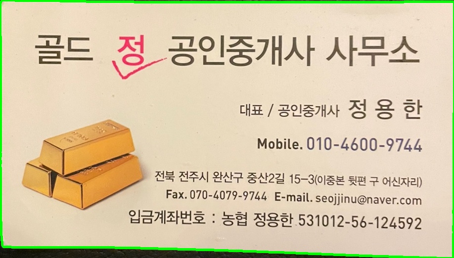

# 명함 OCR

## 프로젝트의 목적
거래처에서 주는 명함들을 손쉽게 관리할 수 있도록 하기 위함

아래의 명함을 예시로 진행한다,

 <br>


> 필요한 패키지 Import
```python
import cv2 #OpenCV
import numpy as np 
```

> 이미지 전처리

컴퓨터가 인식하기 쉽도록 해당 이미지를 전처리한다.
```python
src = cv2.imread("/Users/ksrpn/k3srpn/IMG/gold.jpeg", cv2.IMREAD_COLOR)
#Grayscale
gray = cv2.cvtColor(src, cv2.COLOR_BGR2GRAY)

#Blurring을 통한 Noise제거
blur = cv2.GaussianBlur(gray, ksize=(5,5), sigmaX=0)

#임계값 설정 후 이진화 (Thresholding)
_, thresh = cv2.threshold(blur, 170, 255, cv2.THRESH_BINARY)

#Edge Detection
canny = cv2.Canny(thresh, 10, 250)

#Morph Close
kernel = cv2.getStructuringElement(cv2.MORPH_RECT, (7, 7))
closed = cv2.morphologyEx(canny, cv2.MORPH_CLOSE, kernel)

#Draw Contour
contours, _ = cv2.findContours(closed.copy(), cv2.RETR_EXTERNAL, cv2.CHAIN_APPROX_SIMPLE)
contours_image = cv2.drawContours(src, contours, -1, (0,255,0), 3)
```

> Import한 Image의 배경을 제거하기 위한 알고리즘 설계
Contouring 한 이미지는 Contour 값의 좌표가 생성된다.<br><br>
해당 좌표를 이용해 사각형의 Image를 Crop한다.
~~~python
contours_xy = np.array(contours)
contours_xy.shape

#사각형의 x 좌표의 최솟값과 최댓값 추출
x_min, x_max = 0, 0
value = list()
for i in range(len(contours_xy)):
    for j in range(len(contours_xy[i])):
        value.append(contours_xy[i][j][0][0])
        x_min = min(value)
        x_max = max(value)

#y좌표의 최솟값과 최댓값 추출
y_min, y_max = 0, 0
value = list()
for i in range(len(contours_xy)):
    for j in range(len(contours_xy[i])):
        value.append(contours_xy[i][j][0][1])
        y_min = min(value)
        y_max = max(value)

x = x_min
y = y_min
w = x_max - x_min #너비
h = y_max - y_min #높이
img_trim = src[y:y+h, x:x+w] #좌표만큼 Crop

cv2.imwrite('org_trim.jpg', img_trim)
org_image = cv2.imread('org_trim.jpg')
~~~

~~~python
cv2.imshow("canny", org_image)
cv2.waitKey(0)
cv2.destroyAllWindows()
~~~

Crop된 이미지를 확인하면 아래와 같음을 볼 수 있다.

